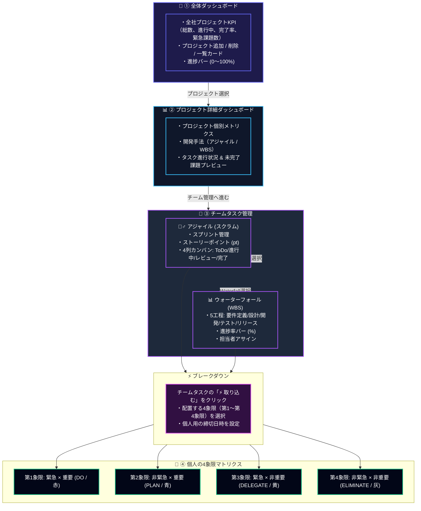

# プロジェクト＆4象限タスクマネージャー (Task Matrix) with AI

アイゼンハワーマトリクス（緊急度 × 重要度）と、**プロジェクト管理・チーム開発手法（アジャイル / ウォーターフォール）の切り替え機能**、そして **Google Gemini AI による意思決定支援（優先度自動判定・タスク自動分解・生産性コーチング）** を統合したモダンなフルスタックタスク管理アプリケーションです。  

**「全体ダッシュボード ➔ プロジェクトダッシュボード ➔ チームタスク ➔ 個人の4象限マトリクス」** という直感的な階層構造に、**AI アシスタント** が組み合わさることで、日々のタスク優先順位の迷いを解消し、最も価値の高い「第2象限（中長期の重要課題）」への投資を最大化します。

---

## ⚡ 技術スタック

| 分野 | 技術 | バージョン / 用途 |
| :--- | :--- | :--- |
| **フロントエンド** | **Nuxt 3** / **Vue 3** | SPA / SSR, TypeScript, Composition API |
| **スタイリング** | **Tailwind CSS** | ダークモード基調のモダン UI（ダッシュボード / カンバン / WBS / 2×2マトリクス / AIポップアップ） |
| **フロントエンドテスト** | **Vitest** + **@vue/test-utils** | Composable 単体テスト・状態管理テスト（全13テストPASS） |
| **バックエンド API** | **Laravel 11** | PHP 8.3, RESTful API, Eloquent ORM |
| **AI / LLM 統合** | **Google Gemini API** | `gemini-3.6-flash` / Structured Outputs (JSON Schema) / インテリジェント・スマートモック内蔵 |
| **バックエンドテスト** | **PHPUnit** / **Pest** | API Feature テスト（全12テスト・104アサーションPASS） |
| **Web サーバー** | **Nginx** | リバースプロキシ (`:8080` 公開) |
| **データベース** | **MySQL 8.0** | データ永続化 (JST `+09:00` 設定済) |
| **インフラ** | **Docker** / **Docker Compose** | サーバーサイド完全コンテナ化 |

---

## 🔄 全体から個人実行への 4 階層ワークフロー



---

## 🎯 画面構成と機能概要

### 1. 🏢 全体ダッシュボード (Global Projects Dashboard)
- **KPI Overview**:
  - 全社・組織全体の「総プロジェクト数」「進行中プロジェクト数」「総タスク数」「全体進捗率（%）」「緊急×重要の要対応タスク数」をリアルタイム集計。
- **プロジェクトカード一覧**:
  - プロジェクト名、テーマカラー、手法バッジ（🏃‍♂️ アジャイル / 📊 ウォーターフォール）
  - 各プロジェクトの進捗バー（0〜100%）、タスク消化数、緊急タスク数
  - 「**+ 新規プロジェクト作成**」モーダル（名称、概要、手法、期間、カラーを選択可能）
  - プロジェクトの「**削除（カスケード削除）**」機能
  - 「**ダッシュボードを開く ➔**」をクリックすると、プロジェクト詳細へ即座に移動。

### 2. 📊 プロジェクトダッシュボード (Project Dashboard)
- 選択されたプロジェクト固有の詳細バナー（名称、手法、期間、進捗メーター、未完了課題）。
- **クイックアクション**:
  - 「👥 チームタスク管理へ進む」ボタンで直結。
  - 「👤 個人4象限へ進む」ボタンでこのプロジェクトに関連する個人タスクへ直結。
- プロジェクトに所属するタスクの進行ステータス一覧プレビュー。

### 3. 👥 チームタスクビュー (Team Tasks: Agile / Waterfall)
- **🏃‍♂️ アジャイル（Agile / Scrum）**:
  - スプリント（Sprint 1 等）ごとにタスクを集計し、合計ストーリーポイント（pt）を表示。
  - 4列のカンバンボード（**未着手 / 進行中 / レビュー中 / 完了**）で直感的に進捗ステータスを更新可能。
  - 各カードに **「⚡ 取り込む」** ボタンを装備。
- **📊 ウォーターフォール（Waterfall / WBS）**:
  - 開発標準の 5 工程（**要件定義 → 基本・詳細設計 → 実装・開発 → テスト・検証 → リリース・移行**）ごとにタスクを分類。
  - 視覚的な **進捗率バー（0〜100%）** と担当者、期日を一元管理。

### 4. 👤 個人タスクビュー (My 4-Quadrant Matrix)
- アイゼンハワーマトリクス（緊急度 × 重要度）の 2×2 グリッド：
  - **第1象限（赤/Rose）**: すぐやる (DO) - 締切直前、緊急対応
  - **第2象限（青/Sky）**: 計画する (PLAN) - 中長期目標、価値創出
  - **第3象限（黄/Amber）**: 委託する (DELEGATE) - 割り込み対応
  - **第4象限（灰/Slate）**: 削減する (ELIMINATE) - 時間浪費、過剰タスク
- **チーム由来タスクの可視化**: チームから取り込んだタスクには `🏢 チーム由来: ○○` バッジが付き、元のチームタスクとの連動関係を維持。
- **内容編集モーダル**: タイトル、詳細メモ、象限、締切（JST日本時間）のインライン編集・解除に対応。

### 5. 🧠 AI インテリジェンス機能 (Google Gemini 連携)
- **✨ AI トリアージ (優先度自動判定)**:
  - タスク名・詳細・期日から、AI が「緊急度(1-5)」「重要度(1-5)」「推奨象限 (DO / PLAN / DELEGATE / ELIMINATE)」および「想定所要時間」を論理的根拠とともに自動判定。
  - ワンクリックで推奨象限と所要時間をタスクに反映可能。
- **⚡ AI タスク自動分解 (Smart Breakdown)**:
  - チームタスクを個人タスクに取り込む際、抽象的な大きなタスクを 15〜60 分単位の具体的なサブタスク（3〜5件）に自動分解。
  - 分解された複数サブタスクをプレビュー確認し、一括で個人4象限タスクとして取り込み可能。
- **📊 AI 生産性コーチング (マトリクス健全度診断)**:
  - 現在のタスク配分比率（第1〜第4象限）を分析し、**100点満点の「マトリクス健全度スコア」**、分析インサイト、具体的推奨アクションを提示。
  - 「緊急対応（第1象限）ばかりに追われていないか」「中長期の価値創出（第2象限）に時間を割けているか」を客観的にアドバイス。
- **🛡️ インテリジェント・フォールバック (スマートモック内蔵)**:
  - Gemini API キーが未設定のローカル/オフライン環境でも、キーワード・期日解析ロジックによるモック推論が自動稼働し、開発やテストを一切ブロックしません。

---

## 📁 ディレクトリ構成

```text
task-matrix/
├── .gitignore                         # Git 除外設定（node_modules, vendor, .env 等）
├── docker-compose.yml                 # サーバーサイドコンテナ構成 (app, web, db)
├── package.json                       # ルート開発用プロキシスクリプト (npm run dev 等)
├── README.md
├── docs/
│   └── google-calendar-sync-spec.md   # Google カレンダー連携 詳細設計書
├── docker/
│   ├── nginx/
│   │   └── default.conf               # Nginx 設定 (8080ポート、PHP-FPM プロキシ)
│   └── php/
│       └── Dockerfile                 # PHP 8.3-fpm + 拡張モジュール
├── backend/                           # Laravel 11 API
│   ├── .env.example                   # 環境変数テンプレート (GEMINI_API_KEY等)
│   ├── artisan
│   ├── composer.json / composer.lock
│   ├── phpunit.xml                    # テスト用設定 (SQLite in-memory)
│   ├── app/
│   │   ├── Http/
│   │   │   ├── Controllers/
│   │   │   │   ├── Controller.php     # ベースコントローラー
│   │   │   │   └── Api/
│   │   │   │       ├── AiController.php      # AI トリアージ / 分解 / コーチング API
│   │   │   │       ├── ProjectController.php # プロジェクト CRUD & KPI サマリー
│   │   │   │       └── TaskController.php    # タスク CRUD & チーム取り込み API
│   │   │   ├── Requests/
│   │   │   │   └── TaskRequest.php    # バリデーション FormRequest
│   │   │   └── Resources/
│   │   │       └── TaskResource.php   # JST 日時整形 Resource
│   │   ├── Models/
│   │   │   ├── Project.php            # プロジェクトモデル (tasks リレーション)
│   │   │   └── Task.php               # タスクモデル (teamTask & project リレーション)
│   │   └── Services/
│   │       └── AiService.php          # Gemini API 呼び出し & スマートモック生成
│   ├── bootstrap/
│   │   ├── app.php                    # Laravel 11 ルーティング・ミドルウェア
│   │   └── providers.php
│   ├── config/
│   │   ├── ai.php                     # AI プロバイダー & モデル設定
│   │   ├── app.php                    # タイムゾーン (Asia/Tokyo) 設定
│   │   └── cors.php                   # localhost:3000 許可設定
│   ├── database/migrations/
│   │   ├── 2024_01_01_000001_create_tasks_table.php
│   │   ├── 2024_01_01_000002_add_team_and_methodology_to_tasks_table.php
│   │   └── 2024_01_01_000003_create_projects_table.php # projects & project_id
│   ├── routes/
│   │   ├── api.php                    # /api/ai/*, /api/projects, /api/tasks
│   │   ├── web.php
│   │   └── console.php
│   └── tests/
│       ├── TestCase.php
│       └── Feature/
│           ├── AiTest.php             # AI API Feature テスト (4テスト・52アサーション)
│           └── TaskApiTest.php        # タスク API Feature テスト (8テスト)
└── frontend/                          # Nuxt 3 フロントエンド
    ├── app.vue
    ├── nuxt.config.ts                 # Tailwind CSS, runtimeConfig 設定
    ├── package.json / package-lock.json
    ├── vitest.config.ts               # Vitest 単体テスト設定
    ├── types/
    │   ├── ai.ts                      # AI 型定義 (Triage, Breakdown, Coach)
    │   ├── project.ts                 # プロジェクト型定義 (Project, ProjectSummary)
    │   └── task.ts                    # タスク型定義 (Task, Scope, Methodology 等)
    ├── composables/
    │   ├── useAi.ts                   # AI 通信・状態管理 Composable
    │   ├── useProjects.ts             # プロジェクト CRUD・状態管理・KPI
    │   └── useTasks.ts                # タスク通信・手法グルーピング・状態管理
    ├── pages/
    │   └── index.vue                  # 全体 ➔ プロジェクト ➔ チーム ➔ 個人4象限 UI
    └── tests/
        └── composables/
            ├── useAi.spec.ts          # AI 機能 単体テスト (4テスト)
            ├── useProjects.spec.ts    # プロジェクト管理 単体テスト (4テスト)
            └── useTasks.spec.ts       # タスク管理 単体テスト (5テスト)
```

---

## 🚀 クイックスタート手順

### 1. サーバーサイド (Docker) の起動

```bash
# プロジェクトルートに移動
cd task-matrix

# コンテナのビルドとバックグラウンド起動
docker-compose up -d --build
```

初回セットアップ（Laravel の依存解決・キー生成・マイグレーション）：

```bash
# Composer パッケージのインストール
docker-compose exec app composer install --no-security-blocking

# 環境変数のコピーとアプリケーションキーの発行
docker-compose exec app cp -n .env.example .env
docker-compose exec app php artisan key:generate

# データベースマイグレーションの実行 (projectsテーブル含む)
docker-compose exec app php artisan migrate
```

- **API 動作確認 URL**: `http://localhost:8080/api/projects` / `http://localhost:8080/api/tasks`

---

### 2. フロントエンド (Nuxt 3) の起動

ルートディレクトリ直下から直接起動できます：

```bash
# ルートディレクトリから起動
npm run dev

# または frontend ディレクトリに移動して起動
cd frontend
npm install  # 初回のみ
npm run dev
```

- **ブラウザでアクセス**: `http://localhost:3000`

---

### 3. AI 機能のセットアップ (任意: Google Gemini API)

本アプリは **API キー未設定時でも自動的に高機能スマートモック推論（キーワード・期日解析ロジック）が稼働する** ため、事前のキー登録なしでもすべての AI 機能（トリアージ、タスク自動分解、生産性コーチング）をお試しいただけます。

実際の最先端 LLM（Google Gemini 3.6 Flash）による文脈理解推論を利用する場合は、以下の手順で API キーを設定します：

1. [Google AI Studio](https://aistudio.google.com/) で Gemini API キーを発行します。
2. `backend/.env` に取得したキーを設定します：
   ```env
   AI_PROVIDER=gemini
   GEMINI_API_KEY=your_gemini_api_key_here
   GEMINI_MODEL=gemini-3.6-flash
   ```
3. 設定完了後、UI 上で「AI トリアージ」や「AI 自動分解」を実行すると、結果モーダルに **`● Gemini AI`** バッジ（緑色）が表示され、リアルタイム LLM 推論が機能していることを確認できます（未設定時は **`● AI Mock (Offline)`** バッジが表示されます）。

---

## 📡 RESTful API 仕様

### AI インテリジェンス API
| メソッド | エンドポイント | 説明 | パラメータ / ボディ |
| :--- | :--- | :--- | :--- |
| `POST` | `/api/ai/triage` | **AI 優先度判定 (トリアージ)** | `{ title, description?, due_date?, scope? }`<br>➔ 象限, 緊急度(1-5), 重要度(1-5), 目安時間, 根拠, アドバイス |
| `POST` | `/api/ai/breakdown` | **AI タスク自動細分化** | `{ title, description?, methodology? }`<br>➔ サブタスク一覧（タイトル, 象限, 目安時間, 解説） |
| `GET` | `/api/ai/coach` | **AI 生産性コーチング** | `?project_id=...&task_scope=personal/team`<br>➔ 健全度スコア(100点), 分析インサイト, 推奨アクション |

### プロジェクト API
| メソッド | エンドポイント | 説明 | パラメータ / ボディ |
| :--- | :--- | :--- | :--- |
| `GET` | `/api/projects/summary` | 全社 KPI サマリー取得 | 総プロジェクト数、総タスク数、全体完了率等 |
| `GET` | `/api/projects` | プロジェクト一覧取得 | 各プロジェクトのタスク消化率・緊急数含む |
| `POST` | `/api/projects` | プロジェクト新規作成 | `{ name, description?, methodology, color?, start_date?, end_date? }` |
| `GET` | `/api/projects/{id}` | プロジェクト詳細取得 | - |
| `PUT` | `/api/projects/{id}` | プロジェクト情報更新 | 更新フィールドオブジェクト |
| `DELETE`| `/api/projects/{id}` | プロジェクト削除 | 紐づくタスクもカスケード削除 |

### タスク API
| メソッド | エンドポイント | 説明 | パラメータ / ボディ |
| :--- | :--- | :--- | :--- |
| `GET` | `/api/tasks` | タスク一覧取得 | `?project_id=...`<br>`?task_scope=team/personal`<br>`?methodology=agile/waterfall/matrix`<br>`?priority_type=...`<br>`?status=todo/in_progress/review/done` |
| `POST` | `/api/tasks` | 新規タスク作成 | `{ project_id?, task_scope, methodology, title, description?, assigned_to?, priority_type?, status?, ... }` |
| `GET` | `/api/tasks/{id}` | タスク詳細取得 | - |
| `PUT` | `/api/tasks/{id}` | タスク内容・進捗更新 | 更新したいフィールドオブジェクト |
| `DELETE` | `/api/tasks/{id}` | タスク削除 | - |
| `POST` | `/api/tasks/{id}/branch-to-personal` | **チームタスクを個人の4象限に取り込む** | `{ priority_type, title?, description?, due_date? }` |

---

## 🧪 テストの実行方法

### 1. バックエンド API テスト (Laravel / PHPUnit)
```bash
docker-compose exec app php artisan test
```
- AI トリアージ、タスク自動分解、AI コーチング、プロジェクト＆タスク CRUD、象限フィルター、バリデーションエラー等の **全 12 テスト・104 アサーションがすべて自動実行され、PASS します。**

### 2. フロントエンド単体テスト (Nuxt 3 / Vitest)
```bash
# ルートから実行
npm run test

# または frontend ディレクトリで実行
cd frontend
npm run test
```
- AI 機能（優先度判定、タスク自動分解、コーチング取得、バリデーション）の 4 テスト
- プロジェクト管理（一覧取得、新規作成、削除、選択切り替え）の 4 テスト
- タスク管理（チーム/個人のタスク分離、アジャイルカンバン列分類、ウォーターフォールフェーズ分類、個人タスクへの取り込み）の 5 テスト
- **合計 13 テストがすべて自動実行され、PASS します。**

---

## 🧭 将来の拡張性

### 1. Google Calendar API 連携
- [docs/google-calendar-sync-spec.md](docs/google-calendar-sync-spec.md) に詳細設計書を配備済み。
- 4象限カラーと Google Calendar の `colorId`（1〜11）を一致させた非同期キュー同期アーキテクチャを定義しています。

### 2. AWS 本番環境展開
- **バックエンド**: `docker/php/Dockerfile` をマルチステージビルド化して AWS ECR にプッシュし、AWS App Runner または ECS Fargate で稼働。DB は Amazon RDS (Aurora MySQL) へ接続。
- **フロントエンド**: AWS Amplify または S3 + CloudFront / Vercel に静的・SSR ホスティングし、環境変数 `NUXT_PUBLIC_API_BASE` で API 接続先を指定。
