# Google カレンダー同期機能 詳細設計書

本書は、Nuxt 3（フロントエンド）および Laravel 11（バックエンド API）で構築された「4象限タスクマネージャー」と、Google Calendar API を双方向・リアルタイムに連携するための詳細設計書です。

---

## 1. システム連携方針・認証方式

### 1.1 認証方式の選定
- **採用方式**: **Google OAuth 2.0 (ユーザー個別認証・オフラインアクセス)**
- **スコープ (Scope)**:
  - `https://www.googleapis.com/auth/calendar.events` (イベントの閲覧・作成・更新・削除)
  - `https://www.googleapis.com/auth/userinfo.profile` / `email` (アカウント識別)
- **トークン保持**:
  - バックグラウンド非同期同期を行うため、初回認可時に `access_type=offline` および `prompt=consent` を指定して **Refresh Token** を取得・暗号化保存します。

### 1.2 全体アーキテクチャ図

```mermaid
sequenceDiagram
    autonumber
    actor User as ユーザー
    participant Nuxt as Nuxt 3 (Frontend)
    participant Laravel as Laravel 11 (API)
    participant Queue as Redis/DB Queue Worker
    participant GCal as Google Calendar API

    %% 認可フロー
    rect rgb(30, 41, 59)
    Note over User, GCal: 【OAuth 認可・連携フロー】
    User->>Nuxt: 「Google カレンダー連携」クリック
    Nuxt->>Laravel: GET /api/auth/google/redirect
    Laravel-->>Nuxt: 認可URL返却
    Nuxt->>GCal: Googleログイン・アクセス同意
    GCal-->>Nuxt: 認可コード付与してリダイレクト (/auth/callback)
    Nuxt->>Laravel: POST /api/auth/google/callback { code }
    Laravel->>GCal: トークン交換要求
    GCal-->>Laravel: Access Token & Refresh Token 返却
    Laravel->>Laravel: トークンを暗号化保存 (google_tokens)
    Laravel-->>Nuxt: 連携完了ステータス返却
    end

    %% タスク変更時の非同期同期
    rect rgb(15, 23, 42)
    Note over User, GCal: 【タスク変更時のイベント同期フロー】
    User->>Nuxt: タスク作成 / 編集 / 削除 / 象限移動
    Nuxt->>Laravel: PUT /api/tasks/{id}
    Laravel->>Laravel: tasks テーブル更新 (sync_status = 'pending')
    Laravel->>Queue: SyncGoogleCalendarJob をディスパッチ (即座に応答)
    Laravel-->>Nuxt: 200 OK (即座にUIへ反映)
    Queue->>Laravel: ジョブ実行 (最新トークン検証・自動リフレッシュ)
    Queue->>GCal: イベント登録/更新/削除 (colorId等を象限に同期)
    GCal-->>Queue: google_event_id / ETag 返却
    Queue->>Laravel: tasks テーブル更新 (sync_status = 'synced', google_event_id)
    end
```



---

## 2. データベース設計 (スキーマ拡張)

### 2.1 新規テーブル: `google_tokens`
Google アカウント情報および OAuth 認証情報を安全に管理します。

```sql
CREATE TABLE `google_tokens` (
    `id` BIGINT UNSIGNED AUTO_INCREMENT PRIMARY KEY,
    `google_id` VARCHAR(255) NOT NULL UNIQUE COMMENT 'Google Account Sub ID',
    `email` VARCHAR(255) NOT NULL,
    `access_token` TEXT NOT NULL COMMENT '暗号化されたアクセストークン',
    `refresh_token` TEXT NOT NULL COMMENT '暗号化されたリフレッシュトークン',
    `expires_at` DATETIME NOT NULL COMMENT 'アクセストークン有効期限',
    `calendar_id` VARCHAR(255) NOT NULL DEFAULT 'primary' COMMENT '同期先カレンダーID',
    `sync_token` VARCHAR(512) NULL COMMENT 'Googleカレンダー差分同期用トークン',
    `created_at` TIMESTAMP NULL,
    `updated_at` TIMESTAMP NULL
) ENGINE=InnoDB DEFAULT CHARSET=utf8mb4 COLLATE=utf8mb4_unicode_ci;
```

### 2.2 既存 `tasks` テーブルの拡張
同期状態や最終同期日時を追跡できるように拡張します。

```sql
ALTER TABLE `tasks`
    ADD COLUMN `sync_status` ENUM('not_synced', 'pending', 'synced', 'failed') NOT NULL DEFAULT 'not_synced' AFTER `google_event_id`,
    ADD COLUMN `synced_at` DATETIME NULL AFTER `sync_status`,
    ADD COLUMN `sync_error_message` TEXT NULL AFTER `synced_at`,
    ADD COLUMN `google_etag` VARCHAR(255) NULL AFTER `sync_error_message`;

CREATE INDEX `idx_tasks_sync_status` ON `tasks` (`sync_status`);
```

---

## 3. 象限マトリクス × Google カレンダー イベントマッピング設計

### 3.1 4象限と Google Calendar `colorId` の対応表
Google Calendar API ではイベントごとに `colorId`（1〜11）を指定可能です。タスクの象限カラーと完全に一致させます。

| 象限 | 象限名称 / アクション | UI カラー | Google Calendar `colorId` | Google カラー名 |
| :--- | :--- | :--- | :--- | :--- |
| **第1象限** | 緊急 × 重要 (すぐやる / DO) | **赤 (Rose)** | **`"11"`** (または `"4"`) | Tomato (赤) / Flamingo |
| **第2象限** | 非緊急 × 重要 (計画する / PLAN) | **青 (Sky)** | **`"9"`** (または `"1"`) | Blueberry (濃青) / Lavender |
| **第3象限** | 緊急 × 非重要 (委託する / DELEGATE) | **黄 (Amber)** | **`"5"`** | Banana (黄) |
| **第4象限** | 非緊急 × 非重要 (削減する / ELIMINATE) | **灰 (Slate)** | **`"8"`** | Graphite (グレー) |

### 3.2 日時 (Start/End) 変換ルール
- **`due_date` が設定されている場合**:
  - `start.dateTime`: `due_date` の 30分前（または指定日時）
  - `end.dateTime`: `due_date`
  - `timeZone`: `Asia/Tokyo`
- **`due_date` が未設定の場合**:
  - カレンダー上には同期しない（または「今日」の終日タスクとして登録するトグル設定）。
- **タスク完了 (`is_completed = true`) 時**:
  - タイトル先頭に `[完了] ` を付与し、カレンダー上でも一目で完了状態を把握可能にする。
  - カレンダーイベントの説明文に、タスクの URL や詳細メモを記載。

---

## 4. バックエンド実装設計 (Laravel 11)

### 4.1 必要ライブラリ
```bash
composer require google/apiclient:^2.15
```

### 4.2 クラス・サービス構成
```text
backend/app/
├── Services/
│   └── GoogleCalendarService.php     # Google API クライアント初期化・CRUD委譲
├── Jobs/
│   └── SyncTaskToGoogleCalendarJob.php # 非同期キューワーカー処理
├── Http/
│   └── Controllers/Api/
│       ├── GoogleAuthController.php   # OAuth Redirect & Callback
│       └── TaskController.php         # 保存時に Job をディスパッチ
└── Observers/
    └── TaskObserver.php               # Task モデルの created/updated/deleted を自動検知
```

### 4.3 `GoogleCalendarService` 処理ロジック (骨子)
- **トークン自動リフレッシュ**:
  `$client->isAccessTokenExpired()` を判定し、期限切れの場合は `$client->fetchAccessTokenWithRefreshToken()` を呼び出し、最新のアクセストークンを DB へ再暗号化保存。
- **冪等性 (Idempotency) の担保**:
  - `google_event_id` が null の場合: `events->insert()` を実行し、取得した `id` を保存。
  - `google_event_id` が存在する場合: `events->patch()` または `update()` を実行。
  - タスク削除時: `events->delete()` を呼び出す（404エラーの場合は正常無視）。

---

## 5. RESTful API エンドポイント仕様 (追加分)

| メソッド | パス | 説明 | リクエスト / レスポンス |
| :--- | :--- | :--- | :--- |
| `GET` | `/api/auth/google/url` | OAuth 認可 URL の取得 | レスポンス: `{ "url": "https://accounts.google.com/..." }` |
| `POST` | `/api/auth/google/callback` | 認可コードの検証・トークン保存 | ボディ: `{ "code": "4/0A..." }`<br>レスポンス: `{ "connected": true, "email": "user@gmail.com" }` |
| `GET` | `/api/auth/google/status` | 現在の連携状況取得 | レスポンス: `{ "is_connected": true, "email": "...", "synced_at": "..." }` |
| `DELETE` | `/api/auth/google/disconnect`| 連携解除 (トークン破棄) | レスポンス: `{ "message": "Disconnected" }` |
| `POST` | `/api/tasks/{id}/sync-calendar` | 個別タスクの手動再同期 | レスポンス: `TaskResource` |

---

## 6. フロントエンド UI/UX 設計 (Nuxt 3)

### 6.1 ヘッダー / 設定パネル
- ヘッダー右上に **「Google Calendar 連携」** ボタン/バッジを配置。
  - 未連携時: グレーアイコン（「カレンダーと連携する」）
  - 連携済時: Google アイコン＋「user@example.com (同期中)」
  - 同期中: ローディングスピナーアニメーション

### 6.2 タスクカード上の表示
- `google_event_id` が存在し、`sync_status === 'synced'` の場合:
  - 「カレンダー同期済」バッジを表示。クリックすると Google カレンダー該当イベントへのディープリンク（`https://calendar.google.com/calendar/r/eventedit/...`）を開く。
- 同期エラー時 (`sync_status === 'failed'`):
  - 警告アイコンと「再同期」ボタンを表示。

---

## 7. 非同期処理 & 障害対策 (Resilience & Rate Limits)

1. **API Rate Limit 回避 (指数バックオフ)**
   - Google Calendar API はユーザーごとの短時間アクセス制限があります。
   - `SyncTaskToGoogleCalendarJob` に `$tries = 3` および `$backoff = [10, 60, 300]` を設定し、一時的なレートリミット (429 Too Many Requests) や 503 エラー時は自動リトライ。
2. **キューの分離**
   - 他の通常処理と競合しないよう、カレンダー同期専用のキュー名（`google-calendar`）を用意。
3. **競合防止 (Optimistic Locking)**
   - Google Calendar から返却される `etag` を保存し、複数端末での同時編集時の競合を防止。

---

## 8. 実装ロードマップ

- [ ] **フェーズ 1**: Google Cloud Console でのプロジェクト作成 & OAuth 2.0 クライアント ID / Secret 取得
- [ ] **フェーズ 2**: DB マイグレーション (`google_tokens` 作成、`tasks` へのカラム追加)
- [ ] **フェーズ 3**: Laravel 側 OAuth 認証コントローラー & `GoogleCalendarService` 実装
- [ ] **フェーズ 4**: `SyncTaskToGoogleCalendarJob` によるタスク作成・更新・削除の非同期同期
- [ ] **フェーズ 5**: Nuxt 3 フロントエンドの連携ボタン・認証コールバック画面・同期状態バッジの実装
- [ ] **フェーズ 6**: 統合テスト (モックテスト & 実際の Google アカウントとの疎通確認)
